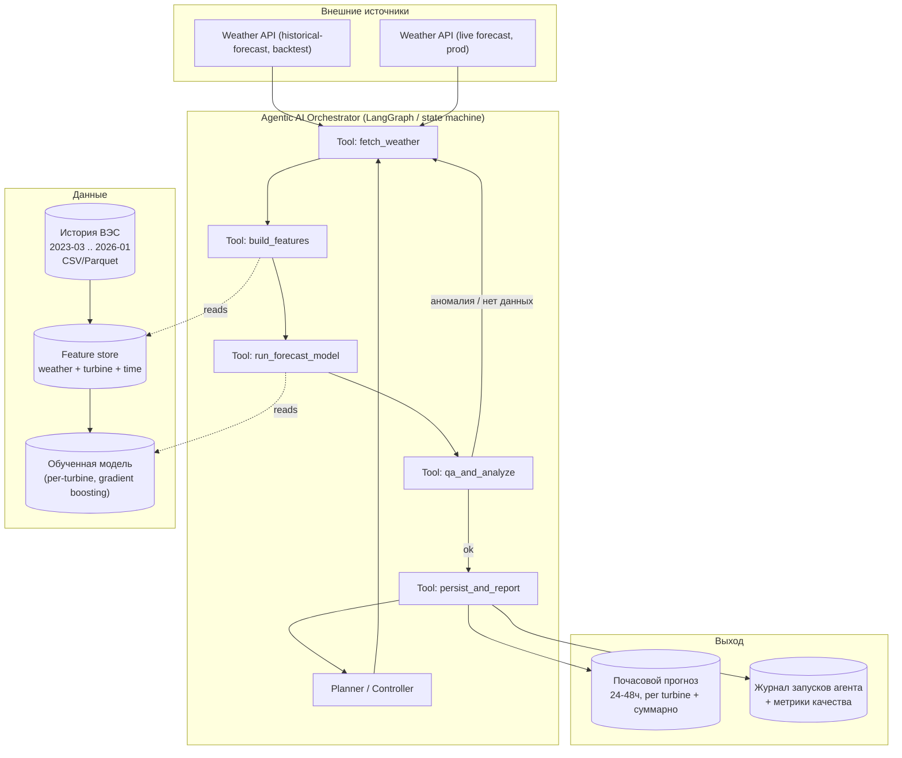

# Agentic AI для прогнозирования выработки ВЭС — план решения и архитектура

## 1. Постановка задачи (из кейса)

Разработать **Agentic AI-систему**, которая прогнозирует почасовую выработку ветроэлектростанции (2 турбины) на горизонте **24–48 часов**.

Даны:
- координаты 2 турбин;
- исторические данные с марта 2023 по 31.01.2026: время, средняя скорость ветра (м/с), нормализованная активная мощность на стороне линии, средняя температура воздуха (°C).

Нужно:
- обучить модель прогнозирования на истории;
- **самостоятельно** (агентно) получать погодные прогнозы по координатам из открытых источников;
- строить почасовой прогноз на 24–48 ч вперёд;
- реализовать это как **agentic-цикл**: получение погоды → подготовка данных → инференс модели → формирование прогноза → анализ результата → повторный расчёт при обновлении входных данных;
- **воспроизвести исторический процесс**: как будто прогноз действительно делался каждый день в период 31.01–27.02.2026, используя **только те архивные прогнозы погоды, что были доступны на тот момент** (без утечки будущих/фактических данных) — чтобы получить прогнозы на весь тестовый период 01.02–28.02.2026.

Критерии оценки (100 баллов): соответствие задаче/работоспособность (25), техническая реализация (25), README/воспроизводимость (25), ценность/применимость (15), потенциал развития/оригинальность (10).

## 2. Главный технический риск и его решение

Самая частая ошибка в таких кейсах — **утечка данных (data leakage)**: при бэктесте на февраль 2026 взять "текущий" прогноз погоды или фактическую погоду вместо архивного прогноза, который реально существовал 31 января. Жюри прямо проверяет это пунктом 24 условия.

**Решение (проверено на реальных запросах, см. раздел 6.4):** использовать **Open-Meteo Previous Runs API** (`previous-runs-api.open-meteo.com`) — сервис, который для каждого часа отдаёт значение, **фактически спрогнозированное на фиксированный lead time раньше** (`<переменная>_previous_day1` = прогноз, выпущенный ~24ч до этого часа, `_previous_day2` = ~48ч до) — то есть ровно горизонт 24–48ч, который требует кейс. Это единственный источник для бэктеста и для тренировочных фич за период, где он доступен.

Важное уточнение, которое первая версия плана не учитывала: архив Previous Runs API **не покрывает всю историю с марта 2023** — для координат турбин эмпирически (см. 6.4) измерено, что данные появляются только с **2024-01-19**. Для обучающего периода 2023-03-11 → 2024-01-18 в качестве прокси-признаков погоды используется **Open-Meteo Historical Weather API** (`archive-api.open-meteo.com`, реанализ ERA5 — фактическая, а не прогнозная погода). Это документированное ограничение (реанализ точнее и глаже реального 24–48ч прогноза), поэтому такие строки помечаются `weather_source="reanalysis_proxy"` и **никогда не используются для тестового периода Feb-2026** — там граница "что было реально известно на дату d" абсолютно чистая. Для продовской работы агента после хакатона используется обычный live forecast API (`api.open-meteo.com`) той же экосистемы — переключение "backtest / real-time" — это смена источника данных в едином клиенте, а не архитектуры.

## 3. Общая архитектура



Оркестратор запускается либо:
- **в режиме backtest** — раннер прогоняет цикл ежедневно с 31.01.2026 по 27.02.2026, каждый раз "замораживая" время (агент "не знает", что происходит после даты запуска);
- **в режиме production** — по расписанию (cron/scheduler), с живым источником погоды.

## 4. Данные

### 4.0 Фактический датасет (уже получен, лежит в `data/`)

Два CSV, переданные организаторами:

- `data/Dataset HackAlemAI для участников 11.03.2023-28.02.2026 - turbine 1.csv` — 142 360 строк
- `data/Dataset HackAlemAI для участников 11.03.2023-28.02.2026 - turbine 2.csv` — 149 499 строк

Колонки (рус.): `ID`, `Статистическое время`, `Средняя скорость ветра(m/s)`, `Нормализованная активная мощность`, `Средняя температура окружающей среды(°C)`.

Проверено скриптом-профилировщиком:

| Параметр | Turbine 1 | Turbine 2 |
|---|---|---|
| Диапазон дат | 2023-03-11 00:00 → 2026-01-31 23:50 | тот же |
| Разрешение | **10 минут** (не часовое!) | 10 минут |
| Дубликаты timestamp | 0 | 0 |
| NaN/битые значения | 0 | 0 |
| Скорость ветра, м/с | 0.0 – 22.97 | 0.11 – 21.43 |
| Норм. мощность | 0.0 – 1.0, без отрицательных | 0.0 – 1.0 |
| Температура, °C | −19.26 – 43.48 | −19.08 – 43.97 (резко континентальный климат) |
| Пропуски во времени (сегментов) | 67 | 178 |
| Крупнейший провал | **41.6 дня** (2024-05-18 → 2024-06-28) | 2.4 дня (2024-05-18 → 2024-05-20) |
| Доля пропущенных 10-мин интервалов | ~6.6% (~10к из 152.3к) | ~1.9% (~2.9к из 152.3к) |

Важные выводы для пайплайна:
- **Данные 10-минутные, таргет и прогноз — часовые** → обязательный шаг ресемплинга (агрегация `mean` в часовые бины) перед обучением; 10-мин ряд при этом остаётся полезным для лаговых/краткосрочных признаков до момента `t0`.
- Реальных «дыр» немного, но они длинные и неравномерны по турбинам (у turbine 1 — два многодневных сбоя логгера/датчика в 2024, у turbine 2 таких почти нет) → часовые бины с недостаточным покрытием (< порога, напр. < 3 из 6 десятиминуток) помечаются `is_gap=1` и **исключаются из обучения**, а не интерполируются на недели вперёд.
- Помимо крупных провалов есть регулярные короткие (0.3–0.5 дня) паузы в дневное время (~10:30–18:00) в разные даты у обеих турбин — похоже на плановое обслуживание/поверку датчиков; отдельный бинарный признак `maintenance_window` не помешает, но специально его моделировать не обязательно для MVP.
- Мощность нормализована и не выходит за [0,1] → отдельная проверка физических границ в `qa_and_analyze` (раздел 6.1) уже покрывает этот случай "из коробки".
- Даты истории заканчиваются ровно 2026-01-31 23:50 — совпадает с условием задачи (история "включительно" по 31.01.2026), фактических данных за тестовый период (01.02–28.02.2026) в файлах нет — их и не должно быть, чтобы бэктест был честным.

### 4.1 Историческая выработка (per turbine) — обработка
Поля: `timestamp`, `wind_speed_avg`, `active_power_norm`, `temp_avg` (переименовать из русских колонок при загрузке).
Пайплайн предобработки:
1. Парсинг времени, сортировка, проверка на дубли/DST (не найдено, но проверка остаётся в коде на случай будущих обновлений датасета).
2. Ресемплинг 10-мин → часовой (`mean`, плюс `count` строк в бине для контроля покрытия).
3. Разметка часовых бинов с покрытием < порога как `is_gap=1` (см. выше) — исключаются из train/target, но не из фич, где это уместно (напр. для скользящих средних окно просто "перепрыгивает" дыру).
4. Обнаружение и разметка простоев/обрезки (curtailment): мощность ≈0 при высокой скорости ветра — отдельный флаг `curtailment_suspected`, не удаляется молча, т.к. это может быть валидный режим работы, а не ошибка данных.

### 4.1.1 Найденный и исправленный критический баг: часовой пояс исходных данных

При первой сборке обучающего датасета (объединение истории турбины с погодой) корреляция скорость ветра ↔ мощность просела с ожидаемых ~0.95 (см. EDA, где обе величины из одного файла турбины) до **0.33–0.40** — подозрительно низко для физически детерминированной зависимости. Причина: **временные метки в CSV организаторов — не UTC**, а погодный API всегда отдаёт UTC; кейс не указывает исходный часовой пояс явно.

Определили смещение эмпирически: кросс-корреляция собственной скорости ветра турбины с ERA5-реанализом (`fetch_historical_weather`) для тех же координат при сдвиге на N часов, по всей истории 2023-03…2026-01 разом (не по одному месяцу — на месячных выборках пик "плавал" между +5ч и +6ч из-за широкого/шумного максимума суточного цикла ветра). Агрегированно по всем ~24 тыс. часов: **пик корреляции на +6ч (r=0.717)**, вплотную к +5ч (r=0.712), везде остальные сдвиги ≤0.65. +6ч также совпадает с историческим часовым поясом Алматы (UTC+6 до унификации Казахстана на UTC+5 в марте 2024) — при этом излом ровно на дате реформы в данных **не обнаружен** (смещение стабильно на всём периоде, включая 2025–2026), что говорит в пользу фиксированной настройки SCADA-логгера, а не следования политическим изменениям.

**Исправление:** `src/data/schema.py::RAW_TIMESTAMP_UTC_OFFSET_HOURS = 6` — единственное место, где живёт это допущение; `src/data/io.py` вычитает смещение сразу при загрузке (`timestamp_utc = timestamp_raw − 6ч`), так что все нижестоящие этапы (ресемплинг, EDA, join с погодой, будущий backtest) работают в едином UTC без дублирования логики. После исправления и пересборки (`scripts/run_eda.py`, `scripts/build_training_dataset.py`) корреляция wind_speed_100m↔power выросла до **0.68–0.70 при lead=24ч и 0.66–0.68 при lead=48ч** — сильная связь, которая к тому же корректно убывает с горизонтом прогноза, как и должно быть физически. Это единственная нетривиальная гипотеза (а не факт из документации кейса) во всём пайплайне — если организаторы уточнят реальный часовой пояс, достаточно поменять одну константу.

В `scripts/build_training_dataset.py` теперь встроена постоянная проверка (`wind-power corr` в `outputs/dataset/dataset_summary.md` по каждому lead) — падение к ~0 или отсутствие убывания с горизонтом снова будет сигналом рассинхронизации меток времени при любой будущей пересборке.

### 4.2 Координаты турбин
✅ Разрешено: `config/turbines.yaml`. Turbine 1: 43.645150, 78.535604; Turbine 2: 43.643198, 78.538828 (~250 м друг от друга) — регион Жетысу, Казахстан; согласуется с диапазоном температур в датасете (−19…+44 °C, резко континентальный климат).

### 4.3 Погодные признаки
✅ Реализовано в `src/weather/client.py`. Из previous-runs/архива/live-прогноза по координатам турбины запрашиваются: `wind_speed_10m`, `wind_speed_100m` (ближе к высоте ступицы), `wind_direction_10m`, `temperature_2m`, `surface_pressure` (для плотности воздуха) — все подтверждены рабочими запросами к API. `lead_hours` (24 или 48) хранится как отдельная колонка в длинном формате — явный признак горизонта, т.к. точность прогноза погоды падает с лидтаймом.

### 4.4 Feature engineering
- Физически обоснованные: `wind_speed^3` (пропорционально доступной мощности ветра), плотность воздуха `f(P, T)`, произведение плотности на куб скорости;
- Временные: час суток, день года (циклическое кодирование sin/cos), сезон;
- Лаги/тренд по последним фактическим наблюдениям до момента прогноза (t0) — но не позже t0 (иначе утечка);
- Признаки турбины (id, координаты, при необходимости — сорт местности).

## 5. Модель прогнозирования

Двухуровневый подход (устойчив и объясним для жюри):

1. **Физический baseline** — эмпирическая power curve (мощность = f(скорость ветра)), откалиброванная по историческим данным каждой турбины (кусочно-линейная/сигмоидная аппроксимация с насыщением и cut-out). Даёт нижнюю границу качества и sanity-check.
2. **ML-модель поверх остатков или напрямую** — градиентный бустинг (LightGBM/CatBoost) per turbine, обучаемый предсказывать `active_power_norm` по погодным и временным признакам, с **time-based split** (train ≤ конец 2025, валидация — январь 2026, никогда — случайный shuffle). Опционально — квантильная регрессия (P10/P50/P90) для интервалов неопределённости.

Почему не сразу LSTM/Transformer: данных немного (2 турбины × ~2.9 года почасовых = ~25 тыс. строк на турбину), время хакатона ограничено, бустинг с хорошими фичами обычно надёжнее и быстрее интерпретируется для критерия "техническая реализация". Место под seq2seq-модель оставляем в разделе "Развитие".

Метрики: MAE, RMSE, nRMSE (относительно установленной/номинальной мощности), skill score против baseline-персистенции ("прогноз = последнее известное значение") и против чистой power curve — агент должен быть лучше обеих.

## 6. Agentic AI слой

### 6.1 Инструменты (tools) агента
| Tool | Вход | Выход | Логика |
|---|---|---|---|
| `fetch_weather(turbine_id, run_time, horizon_h, mode)` | координаты, момент "сейчас" в бэктесте, горизонт | почасовой прогноз погоды | ✅ основа реализована (`src/weather/client.py`): `fetch_previous_runs` (backtest/train, fixed lead), `fetch_historical_weather` (ERA5-прокси до 2024-01-19), `fetch_live_forecast` (prod); tool-обёртка с выбором источника по `mode` — следующий шаг |
| `build_features(weather, history_up_to_t0, turbine_meta)` | сырые данные | таблица признаков на 24–48 ч вперёд | feature engineering из п.4.4 |
| `run_forecast_model(features, turbine_id)` | признаки | почасовой прогноз мощности (+ интервал) | инференс сохранённой модели |
| `qa_and_analyze(forecast, history)` | прогноз | вердикт ok/anomaly + комментарий | физические ограничения [0,1], сравнение с climatology/persistence, детект NaN/пропусков во входных данных |
| `persist_and_report(forecast, verdict)` | прогноз + вердикт | запись в хранилище + лог | CSV/Parquet + JSON-лог запуска (что использовано, версия модели, метрики) |

### 6.2 Управляющая логика (агентность, а не просто пайплайн)
- Контроллер (LLM-агент или явный state machine на LangGraph) **принимает решения**, а не просто исполняет фиксированную последовательность:
  - если `fetch_weather` вернул неполные/устаревшие данные → повторный запрос/альтернативный источник (напр. Open-Meteo → резервный NOAA/GFS через open-data), затем повтор цикла;
  - если `qa_and_analyze` находит аномалию (напр. прогноз выходит за физические границы, либо погодные данные сильно разошлись между обновлениями) → агент помечает прогноз как low-confidence, инициирует пересчёт при получении нового обновления погоды (условие задания "повторный расчёт при обновлении входных данных");
  - агент формирует короткий текстовый комментарий к каждому прогону (например: "ветер выше среднего для этого часа, ожидается работа близко к номинальной мощности; данные по турбине 2 частично устарели — понижена уверенность").
- Это реализуется как граф состояний (LangGraph) с узлами = инструменты выше и рёбрами условного перехода по результату QA — минимизирует "галлюцинации" LLM в числовой части (модель ML детерминирована), при этом LLM/агентный слой отвечает за оркестрацию, диагностику и объяснение.

### 6.3 Стек
- Python 3.11, LangGraph (или простой custom orchestrator, если время ограничено) для управления циклом;
- LightGBM/CatBoost — модель;
- Open-Meteo (previous-runs + archive + forecast API) — погода;
- pandas/polars — обработка данных;
- SQLite/Parquet — хранилище прогонов и прогнозов;
- Streamlit/простой notebook — визуализация (не обязательно, но повышает "ценность и применимость").

### 6.4 Погодный клиент — реализовано и проверено

`src/weather/{schema,cache,client}.py` + `src/config.py` (координаты турбин). Проверочный прогон: `scripts/run_weather_client_check.py` → `outputs/weather/weather_client_check.md`.

Три функции клиента, единый "длинный" формат (`valid_time | variable | lead_hours | value | source | model | lat | lon`):

| Функция | Источник | Назначение | Проверено на реальных запросах |
|---|---|---|---|
| `fetch_previous_runs` | `previous-runs-api.open-meteo.com`, `<var>_previous_dayN` | бэктест (24ч/48ч lead) + обучение с 2024-01-19 | backtest-окно 31.01–28.02.2026: 6960 строк, 0 пропусков |
| `fetch_historical_weather` | `archive-api.open-meteo.com` (ERA5) | прокси для обучения за 2023-03-11…2024-01-18 | 37 800 строк, 0 пропусков |
| `fetch_live_forecast` | `api.open-meteo.com` | прод/реалтайм после хакатона | 240 строк на 2 турбины × 2 дня, 0 пропусков |
| `find_previous_runs_coverage_start` | бинарный поиск по `fetch_previous_runs` | измеряет фактическую границу архива для данных координат, а не берёт дату "на веру" | обе турбины → **2024-01-19** |

Ключевой факт, изменивший исходный план: архив `previous-runs-api` **не тянется до марта 2023** (документация утверждает "большинство моделей — с января 2024", для наших координат измерено ровно **2024-01-19**). Отсюда — обязательная прокси-ветка на ERA5 для более раннего периода обучения (см. раздел 2 и 4.0), при полностью чистом (без прокси) источнике для самого бэктеста.

Все запросы кэшируются на диск (`data/weather_cache/{previous-runs-api,archive-api,api}/<hash>.json`) — повторный вызов идентичного запроса занимает ~15 мс вместо сетевого round-trip, что закрывает требование воспроизводимости без необходимости коммитить сырые ответы API.

## 7. Воспроизведение исторического процесса (backtest runner)

Отдельный скрипт `run_backtest.py`:
1. Цикл по датам `d` от 2026-01-31 до 2026-02-27 (каждый день — момент "выпуска" прогноза).
2. На каждом шаге вызывает Agentic Orchestrator с `run_time = d`, `mode = "backtest"`, горизонт 24–48 ч.
3. Оркестратор обязан использовать **только** архивный прогноз погоды, инициализированный на/до `d` (никаких данных, "известных" после `d`).
4. Результаты по всем дням объединяются в единый почасовой прогноз на 01.02–28.02.2026 (при пересечении горизонтов — берётся последний по времени выпуска прогноз для каждого часа, как это происходит в реальной эксплуатации).
5. По окончании — сравнение с фактической историей (если она открыта организатором для тестового периода) и расчёт метрик из п.5.

## 8. Структура репозитория

```
├── README.md
├── config/
│   └── turbines.yaml
├── data/
│   ├── raw/                # исходные CSV организаторов (сейчас лежат прямо в data/ — перенести сюда как есть, без изменения содержимого)
│   │   ├── Dataset HackAlemAI ... - turbine 1.csv
│   │   └── Dataset HackAlemAI ... - turbine 2.csv
│   ├── weather_cache/      # закэшированные ответы погодного API (архивные + live), для воспроизводимости
│   └── processed/          # turbine_{id}_hourly.parquet, turbine_{id}_train.parquet
├── src/
│   ├── config.py             # загрузка config/turbines.yaml
│   ├── data/                 # schema.py (в т.ч. RAW_TIMESTAMP_UTC_OFFSET_HOURS), io.py, resample.py
│   ├── weather/               # schema.py, cache.py, client.py — Open-Meteo клиент
│   ├── features/              # schema.py, weather_features.py, build.py — сборка train-датасета
│   ├── models/               # обучение, инференс, power curve baseline (следующий шаг)
│   ├── agent/                 # tools + LangGraph orchestrator
│   └── pipeline/               # backtest_runner.py, realtime_runner.py
├── scripts/
│   ├── run_eda.py                     # шаг 1: EDA + ресемплинг
│   ├── run_weather_client_check.py    # шаг 2: проверка погодного клиента
│   └── build_training_dataset.py       # шаг 3: сборка обучающего датасета
├── notebooks/                   # подбор модели (при необходимости)
├── tests/
├── outputs/
│   ├── eda/                     # eda_summary.md + plots/
│   ├── weather/                  # weather_client_check.md
│   ├── dataset/                   # dataset_summary.md
│   ├── forecasts/                # почасовые прогнозы (csv)
│   └── run_logs/                   # журналы агентных запусков
└── requirements.txt
```

## 9. Дорожная карта (порядок реализации)

1. **EDA + очистка истории** — качество данных, пропуски, curtailment, power curve по турбинам. ✅ Сделано: `scripts/run_eda.py`, `src/data/{schema,io,resample}.py` → `data/processed/turbine_{1,2}_hourly.parquet`, графики и `outputs/eda/eda_summary.md`. Ключевые находки: 10-мин данные без NaN/дублей; после ресемплинга в час ~6.5%/1.8% часов помечены `is_gap` (turbine 1/2 соответственно, из-за многодневных сбоев логгера в 2024); корреляция скорость ветра–мощность 0.95; ~1% часов помечены `curtailment_suspected` по отклонению от собственной эмпирической power curve турбины.
2. **Погодный клиент** — обёртка над Open-Meteo (previous-runs + archive + forecast), кэширование ответов на диск (нужно и для скорости, и для воспроизводимости — "README и воспроизводимость" = 25 баллов). ✅ Сделано: `src/weather/`, `src/config.py`, `config/turbines.yaml` → проверено `scripts/run_weather_client_check.py` (см. раздел 6.4).
3. **Сборка обучающего датасета**: сопоставить историческую выработку с архивным прогнозом погоды на соответствующий lead time (а не с фактической погодой) — это готовит модель к тем же условиям, что и на инференсе. ✅ Сделано: `src/features/{schema,weather_features,build}.py` → `scripts/build_training_dataset.py` → `data/processed/turbine_{1,2}_train.parquet` (46.9к/49.4к строк, обе lead-группы), отчёт `outputs/dataset/dataset_summary.md`. По пути найден и исправлен критический баг с часовым поясом сырых данных турбин (см. раздел 4.1.1) — без него корреляция ветер↔мощность в датасете была нефизично низкой (0.33–0.40); после фикса 0.66–0.70 и корректно убывает с горизонтом (24ч > 48ч).
4. **Baseline (power curve) → ML-модель**, time-based валидация на январе 2026.
5. **Agent tools + orchestrator** (LangGraph state machine), логирование решений.
6. **Backtest runner** на 31.01–27.02.2026, сборка итогового прогноза на весь февраль.
7. **Метрики, графики, отчёт**.
8. **README**: архитектура, как запустить (`pip install -r requirements.txt`, `python -m src.pipeline.run_backtest`), ограничения, откуда брать данные.

MVP для минимального рабочего решения — шаги 1–4 и 6 без сложного агентного графа (просто последовательный pipeline). Шаг 5 добавляет agentic-часть, которая явно требуется условием и оценивается в "техническая реализация" (25 б.).

## 10. Соответствие критериям оценки

| Критерий | Баллы | Как закрываем |
|---|---|---|
| Соответствие задаче и работоспособность | 25 | Полный end-to-end прогон на 01.02–28.02.2026 без утечки данных (архивные прогнозы погоды), почасовая детализация, обе турбины |
| Техническая реализация | 25 | Явный agentic-цикл (LangGraph tools + условные переходы на QA/retry), физически-осмысленные признаки, time-based валидация |
| README и воспроизводимость | 25 | Один command для запуска, зафиксированные версии зависимостей, закэшированные погодные архивы или воспроизводимый fetch-скрипт, диаграмма архитектуры |
| Ценность и применимость | 15 | Метрики против baseline (персистенция/power curve), интервалы неопределённости, применимость к day-ahead планированию/торгам на энергию |
| Потенциал развития и оригинальность | 10 | Мультиисточниковая погода (ансамбль моделей), самокоррекция агента при рассинхроне данных, расширение на портфель ВЭС |

## 11. Риски и меры

| Риск | Мера |
|---|---|
| Утечка данных при бэктесте | Строгое разделение "backtest source" (archived forecast, фиксировано по `run_time`) и "eval source" (факт из истории только для расчёта метрик постфактум) |
| Пропуски/аномалии в истории (простои, обрезка) | Явные флаги качества данных, отдельная обработка, а не удаление молча |
| Нестабильность внешнего API погоды | Кэш ответов на диск + retry-логика в agent tool + резервный источник |
| Переобучение бустинга на 3 годах данных | Time-based CV, ранняя остановка, регуляризация, сравнение со стабильным baseline |
| Жюри не увидит "агентность", если это просто pipeline | Явно показать в коде и логах условные переходы/решения агента (retry, low-confidence, повторный расчёт), а не только линейную последовательность вызовов |

## 12. Возможности развития (за рамками MVP)

- Ансамбль нескольких источников погоды (Open-Meteo + ECMWF + GFS) с агрегацией/взвешиванием по исторической точности каждого источника для данного региона;
- Sequence-модель (Temporal Fusion Transformer) как альтернатива бустингу при наличии времени;
- Автоматическое дообучение модели по мере поступления новых фактических данных (online/periodic retraining), инициируемое агентом;
- Масштабирование на портфель ВЭС/ГЭС/СЭС с общим оркестратором;
- Интеграция прогноза в систему торгов на рынке электроэнергии (day-ahead bidding) как конечный сценарий применения.
