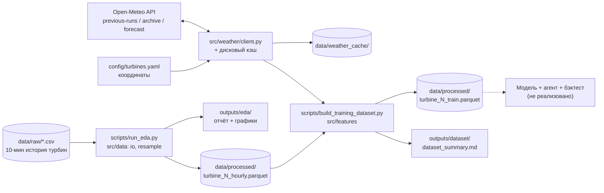

# Stargazer — Agentic AI для прогнозирования выработки ВЭС

Команда Stargazer, хакатон **HackAlem AI**.

> **Статус:** работа в процессе. Готов фундамент по данным: очистка истории турбин, погодный клиент без утечки данных и сборка обучающего датасета. Модель, агентный оркестратор и бэктест на февраль 2026 ещё **не реализованы** (см. [Ограничения](#10-ограничения)).

---

## 1. Название проекта

**Stargazer** — система почасового прогноза выработки ветроэлектростанции (2 турбины) на горизонте 24–48 часов по открытым прогнозам погоды.

## 2. Краткое описание

**Проблема.** Выработка ВЭС зависит от ветра, поэтому операторам и участникам энергорынка нужен заранее известный почасовой прогноз мощности на сутки–двое вперёд: для планирования режимов и заявок.

**Для кого.** Операторы ВЭС, диспетчеры, трейдеры энергорынка (day-ahead планирование).

**Задача кейса.** По истории двух турбин (10-минутные данные с 11.03.2023 по 31.01.2026) и координатам самостоятельно получать прогнозы погоды из открытых источников и строить почасовой прогноз на 24–48 ч. Затем честно воспроизвести ежедневный процесс прогнозирования за 31.01–27.02.2026, используя **только те прогнозы погоды, что были доступны на момент выпуска**.

## 3. Что реализовано

| Компонент | Статус | Где в коде |
|---|---|---|
| Загрузка и профилирование сырых 10-мин данных (диапазоны, дубли, NaN, пропуски во времени) | ✅ | `src/data/io.py`, `scripts/run_eda.py` |
| Ресемплинг 10 мин → 1 час с контролем покрытия, флаг `is_gap` (< 50% из 6 десятиминуток) | ✅ | `src/data/resample.py` |
| Флаг `curtailment_suspected`: мощность сильно ниже собственной эмпирической power curve турбины | ✅ | `src/data/resample.py` |
| EDA-графики (помесячный обзор, power curve, распределения, суточный/сезонный профиль, покрытие) и отчёт | ✅ | `outputs/eda/` |
| Клиент Open-Meteo: 3 источника (previous-runs, ERA5 archive, live forecast), дисковый кэш, retry | ✅ | `src/weather/` |
| Измерение фактической даты начала архива previous-runs для координат турбин (не берётся «на веру») | ✅ | `client.find_previous_runs_coverage_start`, `find_full_coverage_start` |
| Сборка обучающего датасета для лидов 24 ч и 48 ч без утечки данных | ✅ | `src/features/`, `scripts/build_training_dataset.py` |
| Физические и временные признаки: плотность воздуха, куб скорости на высоте 100 м, `power_flux_proxy`, sin/cos часа и дня года | ✅ | `src/features/build.py` |
| Лаговые признаки мощности строго на момент выпуска прогноза `t0 = valid_time − lead` | ✅ | `src/features/build.py` |
| Baseline (power curve) и ML-модель (LightGBM) | ❌ не начато | — |
| Агентный оркестратор (tools + условные переходы, QA, перерасчёт) | ❌ не начато | — |
| Бэктест-раннер 31.01–27.02.2026 и итоговый прогноз на февраль | ❌ не начато | — |

## 4. Как работает решение

Текущий сценарий (от входных данных до обучающей выборки):

1. **Вход:** два CSV организаторов (`data/raw/`), 10-минутные записи: время, средняя скорость ветра, нормализованная активная мощность (0–1), температура.
2. **EDA и очистка** (`scripts/run_eda.py`): профилирование, ресемплинг в час, разметка `is_gap` и `curtailment_suspected` → `data/processed/turbine_{1,2}_hourly.parquet` и отчёт `outputs/eda/eda_summary.md`.
3. **Погода** (`src/weather/client.py`): для каждого часа истории берётся прогноз, **выпущенный за 24 ч / 48 ч до этого часа** (Open-Meteo Previous Runs API, переменные `<var>_previous_day1/2`). Для периода до начала архива (для наших координат — до 2024-01-19) используется реанализ ERA5 как прокси; такие строки помечаются `weather_source="reanalysis_proxy"`.
4. **Сборка датасета** (`scripts/build_training_dataset.py`): объединение часовой выработки с погодой, добавление лагов мощности (только данные до `t0`), физических и временных признаков; исключение часов с `is_gap` и `curtailment_suspected` из таргета → `data/processed/turbine_{1,2}_train.parquet` и отчёт `outputs/dataset/dataset_summary.md`.

Целевой полный цикл по плану (ещё не реализован): получение погоды → признаки → инференс модели → QA-анализ → при аномалии/обновлении данных повторный расчёт → сохранение прогноза и журнала. Подробно: [`PLAN_AND_ARCHITECTURE.md`](PLAN_AND_ARCHITECTURE.md).

## 5. Технологии

- **Язык:** Python (код использует синтаксис `X | None`, нужен Python ≥ 3.10).
- **Данные:** pandas, numpy, pyarrow (Parquet).
- **Визуализация:** matplotlib.
- **HTTP и конфиг:** requests, PyYAML.
- **Внешний API:** Open-Meteo (Previous Runs API, Historical Weather API / ERA5, Forecast API), бесплатный, без API-ключа.
- **Заявлены в `requirements.txt` для следующих шагов, в коде пока не используются:** scikit-learn, lightgbm.
- LLM и AI-модели в текущей версии **не используются**.

## 6. Архитектура проекта



```
├── PLAN_AND_ARCHITECTURE.md   # подробный план, архитектура агента, дорожная карта
├── config/turbines.yaml       # координаты турбин
├── data/
│   ├── *.docx                 # условие кейса от организаторов
│   ├── raw/                   # исходные CSV организаторов
│   └── processed/             # hourly и train parquet
├── src/
│   ├── config.py              # загрузка config/turbines.yaml
│   ├── data/                  # schema, io, resample — история турбин
│   ├── weather/               # schema, cache, client — Open-Meteo
│   └── features/              # schema, weather_features, build — обучающий датасет
├── scripts/
│   ├── run_eda.py
│   ├── run_weather_client_check.py
│   └── build_training_dataset.py
└── outputs/                   # отчёты .md и графики
```

**Как устроена защита от утечки данных:** три источника погоды разведены по назначению. Previous Runs отдаёт значение, спрогнозированное за фиксированный лид (24/48 ч), и только он предназначен для бэктеста. ERA5 используется как прокси лишь для обучающих строк до начала архива и явно помечается. Live forecast нужен для работы в реальном времени. Лаговые признаки мощности берутся строго на момент `t0 = valid_time − lead`. Флаг `curtailment_suspected` вычисляется из таргета, поэтому применяется только как фильтр строк, а не как признак.

## 7. Установка и запуск

```bash
git clone https://github.com/BAITC-Hacks/hack-d5105822-stargazer.git
cd hack-d5105822-stargazer

python -m venv .venv
# Windows:  .venv\Scripts\activate
# Linux/macOS:  source .venv/bin/activate
pip install -r requirements.txt
```

Запуск шагов пайплайна (из корня проекта, по порядку):

```bash
# 1. EDA + ресемплинг → data/processed/turbine_N_hourly.parquet, outputs/eda/
python scripts/run_eda.py

# 2. Проверка погодного клиента → outputs/weather/weather_client_check.md
python scripts/run_weather_client_check.py

# 3. Сборка обучающего датасета → data/processed/turbine_N_train.parquet, outputs/dataset/
python scripts/build_training_dataset.py
```

Шаги 2 и 3 обращаются к Open-Meteo, нужен интернет. Кэш ответов (`data/weather_cache/`) в репозиторий не входит: первый запуск скачивает данные, повторные берут их из кэша.

## 8. Как проверить решение

1. Выполнить шаги из раздела 7.
2. Открыть `outputs/eda/eda_summary.md`. Для turbine 1 ожидается 142 360 сырых строк, диапазон 2023-03-11 → 2026-01-31, 0 NaN и 0 дублей, корреляция ветер–мощность ≈ 0.95. Графики лежат в `outputs/eda/plots/`.
3. Открыть `outputs/weather/weather_client_check.md`. Для окна бэктеста 31.01–28.02.2026 previous-runs должен вернуть 6960 строк без пропусков, измеренное начало архива — 2024-01-19. Повторный запрос берётся из кэша за ~15 мс.
4. Открыть `outputs/dataset/dataset_summary.md` или сам parquet:
   ```python
   import pandas as pd
   df = pd.read_parquet("data/processed/turbine_1_train.parquet")
   print(df.shape, df["lead_hours"].value_counts(), df["weather_source"].value_counts())
   ```
   Проверить, что есть обе группы лидов (24 и 48) и что строки с `reanalysis_proxy` относятся только к периоду до начала архива previous-runs.

Результаты последнего прогона уже лежат в `outputs/` и `data/processed/`, их можно смотреть без запуска.

## 9. Данные и интеграции

| Источник | Что даёт | Использование |
|---|---|---|
| CSV организаторов (`data/raw/`), 2 турбины | 10-мин история: скорость ветра, норм. мощность, температура; 11.03.2023–31.01.2026 | таргет и лаговые признаки |
| Условие кейса (`data/*.docx`) | постановка задачи, ссылки на координаты турбин | → `config/turbines.yaml` |
| [Open-Meteo Previous Runs API](https://open-meteo.com/en/docs/previous-runs-api) | прогноз, выпущенный за 24/48 ч до каждого часа | признаки для обучения (с 2024-01-19) и бэктеста |
| [Open-Meteo Historical Weather API](https://open-meteo.com/en/docs/historical-weather-api) (ERA5) | реанализ (фактическая погода) | прокси-признаки для 2023-03-11 … 2024-01-18 |
| [Open-Meteo Forecast API](https://open-meteo.com/en/docs) | живой прогноз | для работы в реальном времени (пока используется только в проверочном скрипте) |

Погодные переменные: `wind_speed_10m`, `wind_speed_100m`, `wind_direction_10m`, `temperature_2m`, `surface_pressure`.
Координаты: turbine 1 — 43.645150, 78.535604; turbine 2 — 43.643198, 78.538828.

## 10. Ограничения

- **Нет модели прогноза.** Baseline по power curve и LightGBM запланированы, но не реализованы. Метрик качества прогноза пока нет.
- **Нет агентного слоя.** Оркестратор с инструментами, QA-проверкой и перерасчётом при обновлении данных пока существует только в плане (`PLAN_AND_ARCHITECTURE.md`, раздел 6).
- **Нет бэктеста** на 31.01–27.02.2026 и итогового прогноза на февраль 2026.
- **Прокси-погода в начале истории.** Для 2023-03-11 … 2024-01-18 вместо архивного прогноза используется реанализ ERA5. Он точнее реального прогноза на 24–48 ч, поэтому эти строки обучения «оптимистичнее» реальности. Они помечены `weather_source="reanalysis_proxy"`.
- **Пропуски в истории.** У turbine 1 есть многодневные провалы в 2024 году (41.6 и 18.8 дня). Такие часы исключаются из таргета, а не интерполируются.
- **Нет тестов**, веб-интерфейса и Docker-образа.
- **Внешняя зависимость.** Шаги 2–3 требуют доступности Open-Meteo, потому что кэш не закоммичен.
- Отчёт `outputs/dataset/dataset_summary.md` сгенерирован до последней правки `build_training_dataset.py`. После повторного запуска в нём появится колонка с датой начала полного покрытия по каждому лиду.

## 11. Deployed-версия

Deployed-версии нет: проект запускается локально скриптами из раздела 7.
