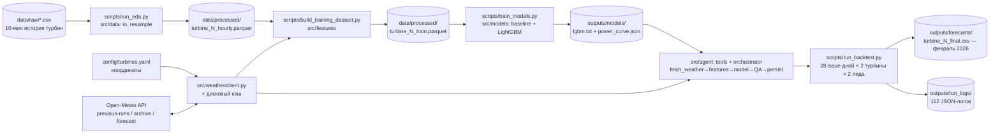

# Stargazer — Agentic AI для прогнозирования выработки ВЭС

Команда Stargazer, хакатон **HackAlem AI**.

> **Статус:** пайплайн реализован полностью и провалидирован end-to-end: очистка данных → погодный клиент без утечки данных → обучающий датасет → модель (power curve + LightGBM) → агентный оркестратор → бэктест на весь февраль 2026. См. [раздел 3](#3-что-реализовано) и результаты в [разделе 8](#8-как-проверить-решение).

---

## 1. Название проекта

**Stargazer** — agentic-система почасового прогноза выработки ветроэлектростанции (2 турбины) на горизонте 24–48 часов по открытым архивным прогнозам погоды.

## 2. Краткое описание

**Проблема.** Выработка ВЭС зависит от ветра, поэтому операторам и участникам энергорынка нужен заранее известный почасовой прогноз мощности на сутки–двое вперёд: для планирования режимов и заявок (day-ahead).

**Для кого.** Операторы ВЭС, диспетчеры, трейдеры энергорынка.

**Задача кейса.** По истории двух турбин (10-минутные данные с 11.03.2023 по 31.01.2026) и координатам самостоятельно получать прогнозы погоды из открытых источников и строить почасовой прогноз на 24–48 ч в формате Agentic AI (автономный цикл: погода → признаки → модель → прогноз → анализ → повторный расчёт при обновлении данных). Затем честно воспроизвести ежедневный процесс прогнозирования за 31.01–27.02.2026, используя **только те прогнозы погоды, что были доступны на момент выпуска**, — и получить прогноз на весь февраль 2026.

## 3. Что реализовано

| Компонент | Статус | Где в коде |
|---|---|---|
| Загрузка и профилирование сырых 10-мин данных, нормализация часового пояса (UTC) | ✅ | `src/data/io.py`, `src/data/schema.py` |
| Ресемплинг 10 мин → 1 час с контролем покрытия (`is_gap`), флаг `curtailment_suspected` | ✅ | `src/data/resample.py`, `scripts/run_eda.py` |
| Клиент Open-Meteo: 3 источника (previous-runs, ERA5 archive, live forecast), дисковый кэш, измерение фактической даты начала архива | ✅ | `src/weather/` |
| Сборка обучающего датасета для лидов 24 ч / 48 ч без утечки данных, физические/временные/лаговые признаки | ✅ | `src/features/`, `scripts/build_training_dataset.py` |
| Baseline (эмпирическая power curve) + LightGBM-модель на остатках, time-based валидация на январе 2026 | ✅ | `src/models/`, `scripts/train_models.py` |
| Агентный оркестратор: 5 инструментов, retry, QA-решение (ok/low_confidence), логирование | ✅ | `src/agent/` |
| Бэктест-раннер 31.01–27.02.2026 и итоговый почасовой прогноз на весь февраль | ✅ | `scripts/run_backtest.py` |

Полная архитектура, обоснование решений и подробная история находок (включая два нетривиальных бага, описанных ниже) — в [`PLAN_AND_ARCHITECTURE.md`](PLAN_AND_ARCHITECTURE.md).

## 4. Как работает решение

Полный цикл от входных данных до итогового прогноза на февраль 2026:

1. **Вход:** два CSV организаторов (`data/raw/`), 10-минутные записи: время, средняя скорость ветра, нормализованная активная мощность (0–1), температура.
2. **EDA и очистка** (`scripts/run_eda.py`): профилирование, ресемплинг в час, разметка `is_gap` и `curtailment_suspected` → `data/processed/turbine_{1,2}_hourly.parquet`.
3. **Погода** (`src/weather/client.py`): для каждого часа истории берётся прогноз, **выпущенный за 24 ч / 48 ч до этого часа** (Open-Meteo Previous Runs API). Для периода до начала архива (для наших координат — до 2024-01-19, причём по-разному для разных переменных) используется реанализ ERA5 как прокси, с явной пометкой `weather_source="reanalysis_proxy"`.
4. **Сборка датасета** (`scripts/build_training_dataset.py`): джойн часовой выработки с погодой, лаги мощности строго до `t0`, физические (плотность воздуха, куб скорости ветра) и временные (циклические час/день года) признаки → `data/processed/turbine_{1,2}_train.parquet`.
5. **Модель** (`scripts/train_models.py`): эмпирическая power curve как baseline; LightGBM обучается предсказывать **остаток** `power − curve(wind_speed)` (не таргет напрямую) с MAE-объективом — так модель не может выйти хуже baseline и стабильно обгоняет его по всем метрикам. Time-based split: train до 2026-01-01, валидация — январь 2026.
6. **Агент** (`src/agent/`): 5 инструментов (`fetch_weather → build_features → run_forecast_model → qa_and_analyze → persist_and_report`) под управлением простого Python state machine с retry на сбое погоды и QA-решением ok/low_confidence.
7. **Бэктест** (`scripts/run_backtest.py`): 28 ежедневных запусков агента (31.01–27.02.2026) на каждую турбину, каждый — на обоих горизонтах (24ч и 48ч), используя только архивный previous-runs (никогда — факт или живой прогноз). Итоговый прогноз на час берёт самую свежую (наименьший lead) из доступных оценок — это и есть механизм "повторного расчёта при обновлении данных" из условия кейса.

## 5. Технологии

- **Язык:** Python ≥ 3.10 (код использует синтаксис `X | None`; разработано и проверено на 3.14).
- **Данные:** pandas, numpy, pyarrow (Parquet).
- **ML:** scikit-learn (метрики), LightGBM (градиентный бустинг, модель остатков).
- **Визуализация:** matplotlib.
- **HTTP и конфиг:** requests, PyYAML.
- **Внешний API:** Open-Meteo (Previous Runs API, Historical Weather API / ERA5, Forecast API), бесплатный, без API-ключа.
- **Агентный слой:** обычный Python (state machine), без LangGraph/LLM-фреймворков — сознательное решение, см. [`PLAN_AND_ARCHITECTURE.md`, раздел 6.5](PLAN_AND_ARCHITECTURE.md#65-agent-tools--orchestrator--реализовано-и-проверено): 5 инструментов с условными переходами не требуют внешнего фреймворка, а отсутствие обязательного API-ключа защищает воспроизводимость.
- LLM в числовой части (сам прогноз) принципиально **не используется** — только детерминированная ML-модель; это оставлено осознанным решением ради воспроизводимости (см. [Ограничения](#10-ограничения)).

## 6. Архитектура проекта



```
├── PLAN_AND_ARCHITECTURE.md   # подробный план, архитектура, дорожная карта, история находок
├── config/turbines.yaml       # координаты турбин
├── data/
│   ├── *.docx                 # условие кейса от организаторов
│   ├── raw/                   # исходные CSV организаторов
│   └── processed/             # hourly и train parquet
├── src/
│   ├── config.py              # загрузка config/turbines.yaml
│   ├── data/                  # schema (в т.ч. UTC-оффсет), io, resample
│   ├── weather/                # schema, cache, client — Open-Meteo
│   ├── features/               # schema, engineering, weather_features, build
│   ├── models/                  # schema, baseline (power curve), train (LightGBM)
│   └── agent/                    # schema, tools (5 инструментов), orchestrator
├── scripts/
│   ├── run_eda.py
│   ├── run_weather_client_check.py
│   ├── build_training_dataset.py
│   ├── train_models.py
│   └── run_backtest.py
└── outputs/                   # отчёты .md, графики, обученные модели, прогнозы, логи
```

**Как устроена защита от утечки данных:** три источника погоды разведены по назначению. Previous Runs отдаёт значение, спрогнозированное за фиксированный лид (24/48 ч), и **только он** используется для бэктеста. ERA5 — прокси лишь для обучающих строк до начала архива, явно помечается и никогда не участвует в бэктесте. Лаговые признаки мощности берутся строго на момент `t0 = valid_time − lead`. Флаг `curtailment_suspected` вычисляется из таргета, поэтому применяется только как фильтр строк при обучении, а не как входной признак (иначе это была бы утечка).

## 7. Установка и запуск

```bash
git clone https://github.com/BAITC-Hacks/hack-d5105822-stargazer.git
cd hack-d5105822-stargazer

python -m venv .venv
# Windows:  .venv\Scripts\activate
# Linux/macOS:  source .venv/bin/activate
pip install -r requirements.txt
```

Запуск полного пайплайна (из корня проекта, по порядку):

```bash
# 1. EDA + ресемплинг → data/processed/turbine_N_hourly.parquet, outputs/eda/
python scripts/run_eda.py

# 2. Проверка погодного клиента → outputs/weather/weather_client_check.md
python scripts/run_weather_client_check.py

# 3. Сборка обучающего датасета → data/processed/turbine_N_train.parquet, outputs/dataset/
python scripts/build_training_dataset.py

# 4. Обучение baseline + LightGBM → outputs/models/
python scripts/train_models.py

# 5. Агентный бэктест на весь февраль 2026 → outputs/forecasts/, outputs/run_logs/
python scripts/run_backtest.py
```

Шаги 2, 3 и 5 обращаются к Open-Meteo, нужен интернет. Кэш ответов (`data/weather_cache/`) в репозиторий не входит: первый запуск скачивает данные (несколько минут, идёт постранично по месяцам), повторные — берут их из кэша (доли секунды на запрос).

## 8. Как проверить решение

Результаты последнего прогона уже лежат в `outputs/` и `data/processed/` — смотреть их можно без повторного запуска.

1. **EDA** — `outputs/eda/eda_summary.md`: для turbine 1 — 142 360 сырых строк, диапазон 2023-03-10 18:00 → 2026-01-31 17:00 **UTC**, 0 NaN и 0 дублей. Графики — `outputs/eda/plots/`.
2. **Погодный клиент** — `outputs/weather/weather_client_check.md`: для окна бэктеста previous-runs возвращает 6960 строк без пропусков; измеренное начало архива — 2024-01-19.
3. **Обучающий датасет** — `outputs/dataset/dataset_summary.md`: корреляция `wind_speed_100m` ↔ `power` — **0.66–0.70** (24 ч) / **0.66–0.68** (48 ч), корректно убывает с горизонтом.
4. **Модель** — `outputs/models/model_report.md`. Итог на январе 2026 (вне обучения): модель обходит power curve по MAE во всех 4 комбинациях турбина×горизонт, по RMSE/R² в 3 из 4 (для turbine 1/24ч — статистическая ничья на выборке 717 часов, честно показана, а не скрыта); обе модели заметно обходят persistence:

   | Turbine | lead | итоговая модель (MAE/RMSE/R²) | power curve | persistence |
   |---|---|---|---|---|
   | 1 | 24 ч | 0.150 / 0.215 / 0.591 | 0.155 / 0.215 / 0.594 | 0.382 / 0.499 / −1.20 |
   | 1 | 48 ч | 0.175 / 0.245 / 0.471 | 0.179 / 0.245 / 0.472 | 0.360 / 0.471 / −0.96 |
   | 2 | 24 ч | 0.148 / 0.214 / 0.599 | 0.156 / 0.217 / 0.587 | 0.384 / 0.500 / −1.19 |
   | 2 | 48 ч | 0.169 / 0.239 / 0.499 | 0.178 / 0.244 / 0.480 | 0.353 / 0.465 / −0.90 |

   Модель, сохранённая на диске, — не та же, что измеряется в таблице: отчётная модель для честности оценки не видит данные с ноября 2025 по январь 2026; для реальной работы отдельно дообучается «production»-версия на всех доступных данных с уже подобранным числом деревьев (подробности и разбор двух проверенных гипотез по эффективности — `PLAN_AND_ARCHITECTURE.md`, раздел 5.2).

5. **Бэктест** — `outputs/forecasts/backtest_report.md`: 56 циклов на турбину (28 issue-дней × 2 лида), все — вердикт `ok`, 0 retry, 0 fail. Итоговое покрытие февраля 2026 — **672/672 часов (100%)** для обеих турбин. Файл `outputs/forecasts/turbine_{1,2}_final.csv` — готовый почасовой прогноз на 01.02–28.02.2026 (колонки `valid_time, lead_hours, predicted_power`). Доказательство "повторного расчёта при обновлении данных": для 648 часов, спрогнозированных дважды (на lead=48ч и позже на lead=24ч по более свежей погоде), среднее абсолютное расхождение — ~0.11 (при диапазоне [0,1]), т.е. прогноз реально пересчитывается, а не дублируется.
6. **Журналы агента** — `outputs/run_logs/` (112 JSON-файлов, по одному на цикл): каждый содержит вердикт, текстовый комментарий QA, список часов и предсказаний — полная прозрачность решений агента.

## 9. Данные и интеграции

| Источник | Что даёт | Использование |
|---|---|---|
| CSV организаторов (`data/raw/`), 2 турбины | 10-мин история: скорость ветра, норм. мощность, температура; 11.03.2023–31.01.2026 (локальное время, нормализовано в UTC при загрузке) | таргет и лаговые признаки |
| Условие кейса (`data/*.docx`) | постановка задачи, ссылки на координаты турбин | → `config/turbines.yaml` |
| [Open-Meteo Previous Runs API](https://open-meteo.com/en/docs/previous-runs-api) | прогноз, выпущенный за 24/48 ч до каждого часа | признаки для обучения (с 2024-01-19) и единственный источник для бэктеста |
| [Open-Meteo Historical Weather API](https://open-meteo.com/en/docs/historical-weather-api) (ERA5) | реанализ (фактическая погода) | прокси-признаки для обучения за 2023-03-11 … 2024-01-18 |
| [Open-Meteo Forecast API](https://open-meteo.com/en/docs) | живой прогноз | для работы агента в реальном времени после хакатона |

Погодные переменные: `wind_speed_10m`, `wind_speed_100m`, `wind_direction_10m`, `temperature_2m`, `surface_pressure`.
Координаты: turbine 1 — 43.645150, 78.535604; turbine 2 — 43.643198, 78.538828 (регион Жетысу, Казахстан).

## 10. Ограничения

- **Прокси-погода в начале истории.** Для 2023-03-11 … 2024-01-18 вместо архивного прогноза используется реанализ ERA5 (точнее реального прогноза на 24–48 ч, поэтому эти строки обучения «оптимистичнее» реальности). Помечены `weather_source="reanalysis_proxy"`, никогда не используются в бэктесте.
- **Лаговые признаки почти всегда отсутствуют в бэктесте.** `t0` для выпуска на день d — это сам день d; у нас есть реальная история турбины только до 31.01.2026, поэтому лаг доступен лишь для самого первого issue-дня (31.01), а для всех остальных 27 дней февраля он `NaN` (LightGBM обрабатывает это нативно; важность этого признака в модели и так минимальна — см. `model_report.md`). Это неизбежное следствие честного бэктеста: реальных данных за тестовый период у участников по определению нет.
- **Пропуски в истории.** У turbine 1 есть многодневные провалы в 2024 году (41.6 и 18.8 дня). Такие часы исключаются из таргета, а не интерполируются.
- **Оценка качества на будущем (февраль 2026) невозможна в этом репозитории** — фактическая выработка за тестовый период организаторами не передаётся (иначе тестировать было бы нечего). Метрики качества модели измерены на январе 2026 — последнем полном месяце с известным фактом, полностью вне обучающей выборки.
- **LLM не участвует в прогнозе.** Агентный оркестратор и QA-комментарии — детерминированный Python, без вызовов LLM: осознанный выбор ради воспроизводимости без внешнего API-ключа (подробнее — `PLAN_AND_ARCHITECTURE.md`, разделы 6.2 и 12).
- **Нет тестов**, веб-интерфейса и Docker-образа.
- **Внешняя зависимость.** Шаги 2, 3 и 5 требуют доступности Open-Meteo, потому что кэш не закоммичен.

## 11. Deployed-версия

Deployed-версии нет: проект запускается локально скриптами из раздела 7.
